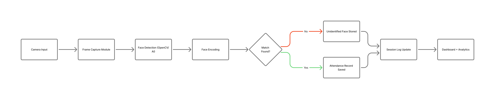

---

# 🌐 **ReconRoll — Intelligent Facial Recognition Attendance System**

<p align="center">
  
</p>

<p align="center">
  <strong>Fast · Modular · Real-Time Facial Recognition Attendance System</strong><br/>
  Built with Django, OpenCV, and Deep Learning–Based Face Encodings
</p>

<p align="center">
  <a href="#"></a>
  <a href="#"></a>
  <a href="#"></a>
  <a href="#"></a>
  <a href="#"></a>
</p>

---

# 📑 **Table of Contents**

* [Overview](#overview)
* [Tech Stack](#tech-stack)
* [System Architecture](#system-architecture)
* [Workflow](#workflow)
* [Key Modules](#key-modules)
* [Installation & Setup](#installation--setup)

  * [Docker Setup (Recommended)](#docker-setup-recommended)
  * [Manual Setup](#manual-setup)
* [How It Works (Simple)](#how-it-works-simple)
* [Contributing](#contributing)
* [Disclaimer](#disclaimer)
* [Author](#author)
* [Developer Notes](#developer-notes)

---

# 🔍 **Overview**

**ReconRoll** is a modular, real-time facial recognition attendance system designed for automation in schools, workplaces, events, and controlled environments.
It provides robust attendance tracking using fast face detection, deep-learning encodings, and session-based logging.

ReconRoll evolved from the earlier *FaceTrack Lite* project and demonstrates a practical application of computer vision and AI engineering.

### Key Capabilities:

* Real-time face detection & recognition
* Automated attendance logging
* Capture of unknown faces for later review
* Attendance sessions with summaries
* Offline-first operation
* Lightweight, simple admin interface

---

# 🧠 **Tech Stack**

| Technology            | Purpose                             |
| --------------------- | ----------------------------------- |
| **Python**            | Core backend language               |
| **OpenCV**            | Face detection + video processing   |
| **face_recognition**  | Deep learning face encodings (dlib) |
| **Django**            | Backend logic and web framework     |
| **SQLite/PostgreSQL** | Database options                    |
| **Docker**            | Containerized deployment            |
| **Bootstrap + JS**    | Admin UI and interactivity          |

---

# 🏗️ **System Architecture**

ReconRoll is designed around four core subsystems:


### **1. Recognition Engine**

* Performs face detection and encoding
* Compares encodings with enrolled users
* Optimized for fast recognition using OpenCV pipelines

### **2. Session Manager**

* Starts, runs, and ends attendance sessions
* Logs recognized users in real time
* Stores unidentified face captures

### **3. Enrollment Pipeline**

* Handles user registration
* Captures and processes face images
* Generates stable 128D embeddings for matching

### **4. Storage Layer**

* Databases for:

  * Encoded faces
  * Attendance records
  * Unknown captures
  * Session histories
* Defaults to SQLite but supports PostgreSQL

---

# 🔄 **Workflow**

### **1. Enrollment**

Admin uploads/captures user photo → generates encoding → saved in DB.

### **2. Start Session**

Admin begins a session → system starts processing frames.

### **3. Recognition Loop**

Frame-by-frame:

* Face detected
* Face encoded
* Recognized → logged
* Unknown → saved

### **4. Session End**

ReconRoll produces:

* Present students
* Absent students
* Unknown face log
* Attendance summary

---

# 🧩 **Key Modules**

| Module                         | Role                                       |
| ------------------------------ | ------------------------------------------ |
| **Recognition Engine**         | Detects, encodes, and matches faces        |
| **Enrollment Service**         | Registers new users and creates embeddings |
| **Session Manager**            | Controls session lifecycle and logging     |
| **Unknown Face Handler**       | Stores unknown captures for review         |
| **Analytics Engine (Planned)** | Attendance stats, performance metrics      |

---

# 🚀 **Installation & Setup**

Before running, you may review the **Pre-Installation Guide**:
[https://docs.google.com/document/d/1OgYudT0YOkN6vht0wn9dWe4mxkAFOjGnz5ulX36hd94/edit?usp=sharing](https://docs.google.com/document/d/1OgYudT0YOkN6vht0wn9dWe4mxkAFOjGnz5ulX36hd94/edit?usp=sharing)

---

## 🐳 **Docker Setup (Recommended)**

```bash
git clone https://github.com/peter-njoro/ReconRoll.git
cd ReconRoll
```

### Start Containers

```bash
# Linux
chmod +x run.sh
./run.sh
```

App available at:

```
http://localhost:8000
```

---

## 🛠️ **Manual Setup**

```bash
git clone https://github.com/peter-njoro/ReconRoll.git
cd ReconRoll
python -m venv venv
source venv/bin/activate        # Linux/macOS
venv\Scripts\activate           # Windows
pip install -r requirements.txt
python manage.py migrate
python manage.py runserver
```

---

# 👁️ **How It Works (Simple)**

1. Camera captures input
2. Face detected
3. Face recognized or marked unknown
4. Attendance logged instantly

---

# 🤝 **Contributing**

Contributions are welcome!

* Fork the repo
* Create a feature branch
* Submit a PR to **development**

---

# ⚠️ **Disclaimer**

ReconRoll is designed for **educational and demo purposes**.
It is not ready for high-security or large-scale deployments.

---

# 👤 **Author**

**[Peter Njoroge Chege](https://www.linkedin.com/in/chege-peter/)**
Machine Learning Engineer (In Progress)
AI • Computer Vision • Backend Engineering

Inspired by the original **Virone** concept by **[Everlyne Mwangi](https://www.linkedin.com/in/everlyne-mwangi-2509b9278/)**.

---

# 📝 **Developer Notes**

If you’re reading this part:

* Yes, pip errors still haunt me.
* Docker promised peace, webcams declared war.
* ReconRoll is both a demo *and* a flex.
* And yes… by the way… I use Arch btw 🟟.
* If this becomes Skynet, at least the README will survive.

---
